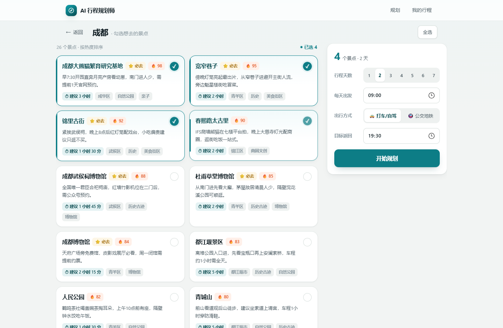

# TripTide — AI 行程规划

国内旅游自助规划工具：**选城市 → 勾景点 → AI 出按天方案**（地理顺路排序、时间轴、餐饮区域、住宿片区与取舍理由）。

V1 交付形态是 **响应式网页版**（Vue 3 + Vite，桌面优先，宽度 ≤640px 才切手机 App 形态），
页面结构与微信小程序一一对应，后续迁原生小程序基本是「HTML→WXML、样式复用」的机械转换。

---

## 技术栈

| 层 | 技术 |
|----|------|
| 前端 | Vue 3 + Vite（`vue-router`，**无 UI 框架**，4 个页面自绘） |
| 后端 | Python 3.11+ / FastAPI + SQLAlchemy 2.0 |
| 数据库 | MySQL 8（`DATABASE_URL` 留空时自动退化为 SQLite，零配置可跑） |
| 大模型 | DeepSeek（默认别名 `deepseek-flash`），OpenAI-compatible 端点 |
| 坐标源 | 高德开放平台 **Web 服务** Key（POI 文本搜索，返回 GCJ-02） |
| 地图渲染 | 高德 **JS API** Key（`frontend/.env`）；缺 Key 自动降级 SVG 示意图 |

---

## 界面

| 宽屏 · 首页 | 宽屏 · 景点池 |
|---|---|
|  |  |

| 宽屏 · 行程结果 | 手机 · 景点池 |
|---|---|
|  |  |

视觉是一套自建的设计系统（`style.css` 顶部的 32 个 CSS 变量）：偏暖的中性底色、多层叠加阴影、
8 色循环的城市图标、按天配色的时间轴（7 色循环）。没有引 UI 框架——这个界面只有 4 页，自绘比配 Element Plus 更轻也更可控。

---

## 页面流程

```
① /trip                城市宫格（8 个热门城市，来自 GET /cities）+ AI 引擎状态提示
      ↓ 点城市
② /trip/pick?city=成都  景点按 heat 降序，多选高亮
      右侧设置面板（手机是底部浮条）：
        · 行程天数 1~7        · 节奏倾向：宽松 / 平衡 / 紧凑
        · 出行方式：🚗 自驾 / 🚕 打车+公共 / 🚇 公共
        · 每天出发 → 目标返回时间
        · ☐ 首末天单独设置（第一天可能中午才到，最后一天要赶飞机）
        · 实时紧凑度预估：轻松 / 适中 / 紧凑 / 超载 + 会舍弃哪些景点
      ↓ 开始规划 → POST /plan → loading（通常 15~30 秒）
③ /trip/plan           按天时间轴 + 折叠区（AI 复核意见 / 舍弃景点 / 必去理由 / 酒店建议）+ 半屏路线地图
      ↻ 重新生成 → 弹窗改参数，可选「按倾向微调」（秒级、不花 token）或「全部重做」（走 LLM）
④ /trip/me             历史规划（localStorage，上限 30 份，点开可回看）
```

---

## 快速开始

### 1. 后端

```bash
cd backend
python -m venv venv
venv\Scripts\python -m pip install -r requirements.txt   # Windows
# source venv/bin/activate && pip install -r requirements.txt   # macOS / Linux

cp .env.example .env      # 填 DATABASE_URL / DEEPSEEK_API_KEY / AMAP_KEY
```

`.env` 三个关键项：

| 变量 | 不填的后果 |
|---|---|
| `DATABASE_URL` | 自动退化为 `backend/data/triptide.db`（SQLite），功能完全一致 |
| `DEEPSEEK_API_KEY` | 规划接口走本地规则引擎兜底，仍能出完整方案（`source=fallback`） |
| `AMAP_KEY` | 初始化用离线种子里手校的坐标，不校准 |

### 2. 灌数据（首次必跑）

```bash
cd backend
venv\Scripts\python -m app.trip.seed              # 全部 8 城
venv\Scripts\python -m app.trip.seed --city 成都   # 只灌一个城市
venv\Scripts\python -m app.trip.seed --list       # 看库里现状
```

有 Key 时走「LLM 出名单 → 高德 POI 搜索补真实坐标」；无 Key 时用离线种子（`data/seed_attractions.json`，8 城 × 20 景 = 160 条）。
一次全量约 160~200 次高德请求，受 `AMAP_SLEEP=0.25s` 串行节流，约 40 秒以上。

### 3. 前端

```bash
cd frontend
npm install
npm run dev        # → http://localhost:5173
```

### 4. 一条命令起前后端（推荐）

```bash
npm install        # 根目录，装 concurrently
npm run dev        # 前端 5173 + 后端 8000
npm run seed       # 等价于 backend 里的初始化
```

浏览器打开 http://localhost:5173 即可，`/api` 由 Vite 自动代理到 8000。

### 5. 回归检查

```bash
# 后端：规则引擎 8 个用例，逐节点校验时间自洽、饭点、主题一致性、景点不凭空消失
cd backend && venv/Scripts/python ../scripts/check_planner.py

# 前端：无头浏览器跑宽屏 + 手机两种视口，走完 4 个页面 + 真实规划（需先起前后端）
python scripts/smoke_ui.py
python scripts/smoke_ui.py --skip-plan
```

前端冒烟测试是必要的——白屏这类问题编译不报错、接口也全 200，只有真跑浏览器才发现。

---

## 设计要点

**地理优先分天 → LLM 审阅 → LLM 并行写内容 → 硬编码物化时间轴 → LLM 终检。**

```
① 硬编码分天      大景点/远郊独占一天 → 其余按直线距离聚成「片区簇」→ 簇分配到天
                  片区簇是原子、不可拆 —— 紧邻景点必然同日
①.5 LLM 审阅      把量化通行时间矩阵给模型提建议，过 5 道硬校验才采纳；不过就沿用①
② LLM 并行写内容   每天一路，ThreadPoolExecutor 并发
③ 硬编码物化       materialize_day() —— 全项目唯一产出时间的地方
④ LLM 终检         读最终时间轴，提意见 + 润色总述
```

**为什么不让 LLM 自己编排。** 第一版是让模型用 10 个工具（function calling）自己编排，
能跑，但**26 次工具调用、1.1 分钟**，而且它会把分天改坏：实测把熊猫基地挪到 14:20（熊猫午后在睡觉）、
把宽窄巷子排进两天。提示词里写了两遍都没拦住——因为「算不算得下」本来就不该由它判断。
改成并行流水线后 **17.7 秒，快 3.7 倍**。

**为什么后来又把 LLM 请回来审阅分天。** 因为**输入不一样了**：新方案给它的是
**预计算的通行时间矩阵**，它不用猜距离、只需读表；再加 5 道硬校验（紧邻必须同天 /
独占独占一天 / 不超预算…），**只可能改好、不可能改坏**。

**时间必须自洽。** `materialize_day()` 内部只有一个 `cur_time` 推进点，所以
`到达 = 上一站离开 + 路程` 恒成立。这条不变量由运行时复核和回归脚本双重守着。

**时间预算是硬的。** 出发 / 返回时间是用户定的硬约束，**不乘任何倾向系数**。
赶返程那天（最后一天 + 显式设了返回时间）会严格卡点：排不下晚餐就不排，
必要时压缩最后一个景点的停留。

**交通按距离分档，纯本地算。** 步行 / 地铁公交 / 打车 / 自驾 / 顺风车 / 城际大巴 / 城际铁路，
按「城区内 / 近郊互通 / 远郊」分档，且分自驾、打车+公共、公共交通三种偏好。
**不接路径规划 API**：一次规划十几条腿，打接口既慢又费配额，±10 分钟误差不影响方案可用性。

**餐饮只给区域，不给店名。** 店铺随时会换，写了反而误导。给的是「区域 + 本地特色小吃」。

**住宿一次定全程。** 按「全程景点的几何中心」选常住片区，只有某天离它超 45km（如成都的都江堰日）才建议就近过夜。

**一键 AI。** 不想逐个勾景点时，只给**城市 + 天数 + 节奏**即可（`POST /auto-plan`）——
服务端按「必去优先 → 热度其次」自动挑景点，再走**同一条**生成链路，
所以产物结构与勾选生成完全一致。

**紧凑度看「日均游览量」。** 把勾选景点的总游览时长摊到每天，与节奏目标（轻松 240 / 平衡 360 /
紧凑 450 分钟）比 —— 比「时间占用率」直观，而且**对天数敏感**（加一天就松一点）。

**降级不静默。** 没配 Key 或流水线失败时自动切规则引擎，并在 `summary` 末尾如实注明原因，
前端也会打上「规则引擎生成」标签。

---

## 响应式设计

**桌面优先**：默认渲染宽屏网页版，只有宽度 ≤640px 才切成手机 App 形态。同一个 DOM 靠媒体查询切换，不做两套模板。

| | 宽屏（≥641px） | 手机（≤640px） |
|---|---|---|
| 容器 | 1120px 居中 | 铺满全屏 |
| 导航 | 顶部导航栏（`SiteHeader`） | 底部标签栏（`TripTabBar`） |
| 首页城市宫格 | `auto-fill minmax(238px, 1fr)`，约 4 列 | 2 列 |
| 景点池 | 左列表（多列卡片）+ 右侧粘性设置面板 | 单列列表 + 固定底部浮条 |
| 结果页 | 时间轴 + 右侧粘性「方案说明」 | 单列，说明落到时间轴下方 |
| 地图按钮 | 页头右侧 | 底部浮条 |
| 重新生成弹窗 | 居中卡片 | 底部上滑 sheet |
| 历史 | 卡片栅格 | 单列 |

**为什么桌面优先**：主场景是「在电脑上规划、在手机上看」，且宽屏信息密度要求更高。
移动优先的写法很容易让宽屏变成「拉大的手机」，反过来则只是少写几条覆盖。

绝大多数差异纯 CSS 就够，只有两处需要 JS 知道形态（`use-media.js` 的 `useIsWide()`）：
设置面板是常驻侧栏还是折叠浮条、地图按钮放页头还是浮条。

---

## 已知取舍（V1）

- **无账号体系**：历史只存 localStorage（上限 30 份），换设备就没了。后端 `GET /plans` 已就绪，接入登录即可切换。
- **通行时间用分档经验系数**，不是真实路径规划：精度约 ±10 分钟，规划阶段够用。要更准需接高德路径规划 API 并按天缓存。
- **时段硬知识是关键词表**：看动物→上午、夜景→15:00 后、博物馆→15:30 前，共 3 类。
  要覆盖更多需给景点加 `best_time` 字段、seed 时由 LLM 标注。
- **景点上限 40 个**：一次勾太多会超上下文，路由层直接拦掉。
- **并发是单进程**：一天一路并行（`MAX_WORKERS=4`）。要支撑多人需改异步队列 + 轮询/SSE。
- **餐饮来源是 LLM 给的片区 + 特色小吃**，不是数据库里的真实店铺（见上方设计要点）。

---

## 未来并入 my-website

本项目按「可嵌入」设计，并库时要做的事很少：

1. `backend/app/trip/` 与 `backend/app/core/` 整目录拷过去；
2. `main.py` 里 `app.include_router(trip_router, prefix="/api/trip")` 一行；
3. `frontend/src/views/trip/`、`components/trip/`、`trip-*.js` 拷过去，
   在站点 `main.js` 注册 4 条 `/trip*` 路由；
4. 配置项名字已经对齐（`DATABASE_URL` / `DEEPSEEK_API_KEY`），`.env` 直接复用。

唯一要改的是 `PhoneShell.vue` —— 嵌进站点时换成站点的页面外壳（去掉应用壳与底部标签栏）。

---

## 文档

| 文档 | 讲什么 |
|---|---|
| [**`docs/README.md`**](docs/README.md) | **文档索引 + 5 分钟速览 + 目录地图（先读这个）** |
| [`docs/CHANGELOG.md`](docs/CHANGELOG.md) | **按日期记录影响架构的改动**（含每次踩坑的原因与解法） |
| [`docs/ARCHITECTURE.md`](docs/ARCHITECTURE.md) | 分层与设计取舍：为什么这么切、交通模型、紧凑度、踩过的坑 |
| [`docs/BACKEND.md`](docs/BACKEND.md) | 后端符号级地图：每个文件导出什么、四张表结构 |
| [`docs/FRONTEND.md`](docs/FRONTEND.md) | 前端符号级地图：路由、组件、状态、设计系统变量表、响应式 |
| [`docs/API.md`](docs/API.md) | 9 个 HTTP 接口的契约、错误码、紧凑度阈值推导 |
| [`docs/PLAN_SCHEMA.md`](docs/PLAN_SCHEMA.md) | 时间轴数据结构 `PlanResult` 全字段说明 |
| [`docs/DEVELOPMENT.md`](docs/DEVELOPMENT.md) | 环境搭建、常用命令、测试、排查表、待办 |
| [`docs/testing-prompt.md`](docs/testing-prompt.md) | 交给其他模型写单元测试用的提示词（自包含） |
| [`AGENTS.md`](AGENTS.md) | 给 AI agent 的操作手册与 17 条铁律 |
